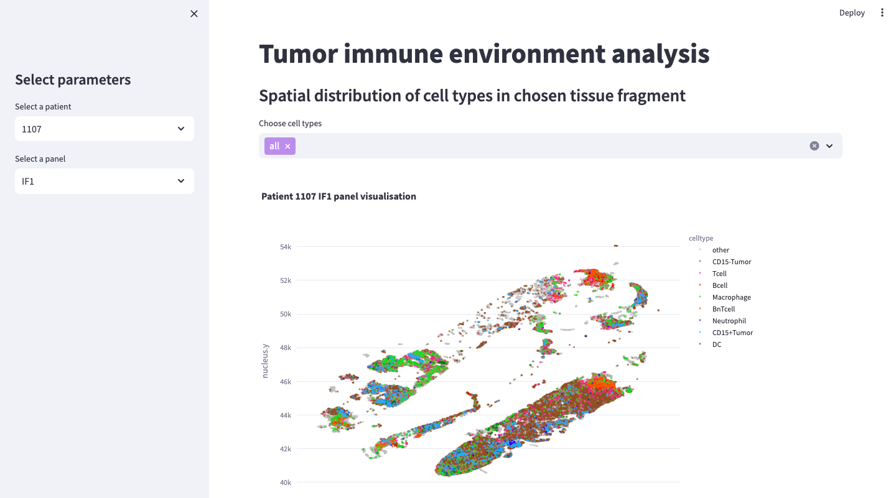

# TLS Analysis in Tumor Biopsy Samples

## Project description

This project focuses on the analysis and visualization of TLS – tertiary lymphoid structures – which are present in biopsy samples from cancer patients.

The results are presented in a Streamlit application, where users can select a specific patient and view a visualization of a fragment of their tissue, highlighting different cell types and identified TLS candidates.

Additionally, the application provides various statistics related to both the TLS of a given patient and the collective data gathered from all studied patients. This allows for comparing results and gaining a better understanding of the research context as well as the nature and diversity of TLS structures.


*App appearance*

## Project structure

The project consists of three main scripts:

* `main.py`: Collects and analyzes data on the number and composition of TLS in all patients and saves it to a file for easy data access.
* `patient_statistics.py`: Gathers statistics and visualizes data for individual patients.
* `app.py`: Summarizes the results of the entire project, presenting them in the Streamlit application.


## Requirements

All required packages are listed in the ```requirements.txt``` file and can be installed using the command ```pip install -r requirements.txt```.


## Running the app
After navigating to the project's source directory, the application can be started with the following command:

```streamlit run app.py```

-----
This project is an assignment for the Systems Biology course 2023/2024
